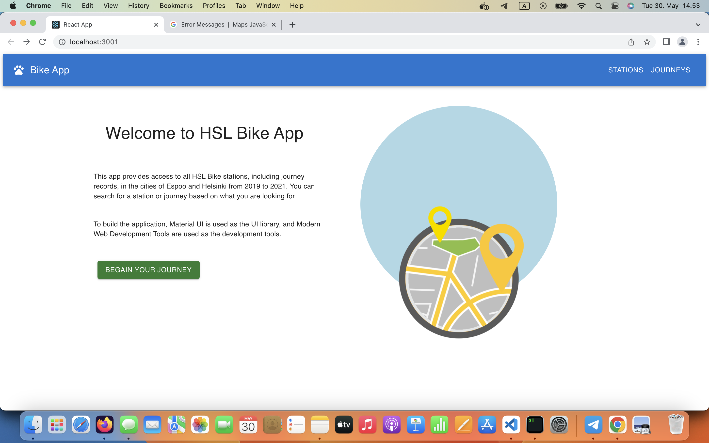

# Getting Started with Create React App

This project is a collaborative effort with the backend, which can be accessed through the [Bike Journey API](https://github.com/MeiSun227/bikeJourney-api). It retrieves data from the a backends REST API and presents it using Material UI components. The project includes unit tests for the components and has the potential for future enhancements, such as incorporating end-to-end testing using tools like Cypress. Lottie React is employed to introduce captivating animation effects on the landing page.

Key features of the project encompass a dedicated single station page that showcases comprehensive station information alongside an interactive map. Additionally, there is a station table equipped with a search bar for convenient exploration, and a journey table featuring search functionality, pagination, and column sorting to facilitate efficient data navigation.

## Table Contents
- [Configuration](#configuration)
- [Features](#features)
- [Testing](#testing)

## Configuration

In the project directory, you can run:

### `npm start`

Runs the app in the development mode.\
Open [http://localhost:3000](http://localhost:3000) to view it in the browser.

The page will reload if you make edits.\
You will also see any lint errors in the console.

### `Google_api_key`

Developers need to configure a Google API key that is used in the map functionality of the application. This can be achieved by setting up an environment variable specifically for the API key. It is important to ensure that the .env file for TypeScript is correctly configured with the necessary types and embedded values. Please make sure to configure the environment variable correctly and embed it in the .env file for the application to function properly.

Read more:
 - https://developers.google.com/maps/documentation/javascript/get-api-key
 - https://dev.to/asjadanis/parsing-env-with-typescript-3jjm

### `Lottie react`

This is a lightweight animated SVG that can be seamlessly embedded into React/TypeScript code using JSON. It offers various motion and functions that can be utilized within the SVG. Developers have the flexibility to explore and utilize additional motion and functionality within the SVG to enhance the user experience

Read more: 
 - https://lottiereact.com/

## Feature
- #### Landing Page

- #### Station Table 

- #### Add Station 

- #### Single Station  

- #### Journey Table

## Testing
Unit tests are implemented with jest and can be run with `npm run test`

